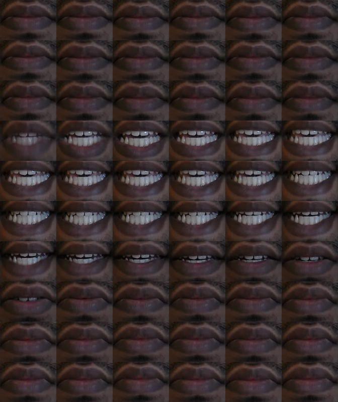
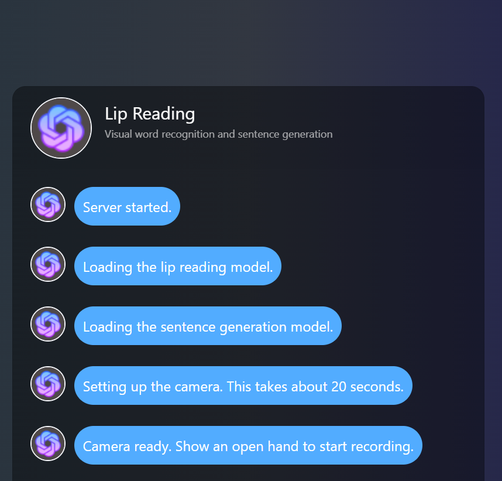
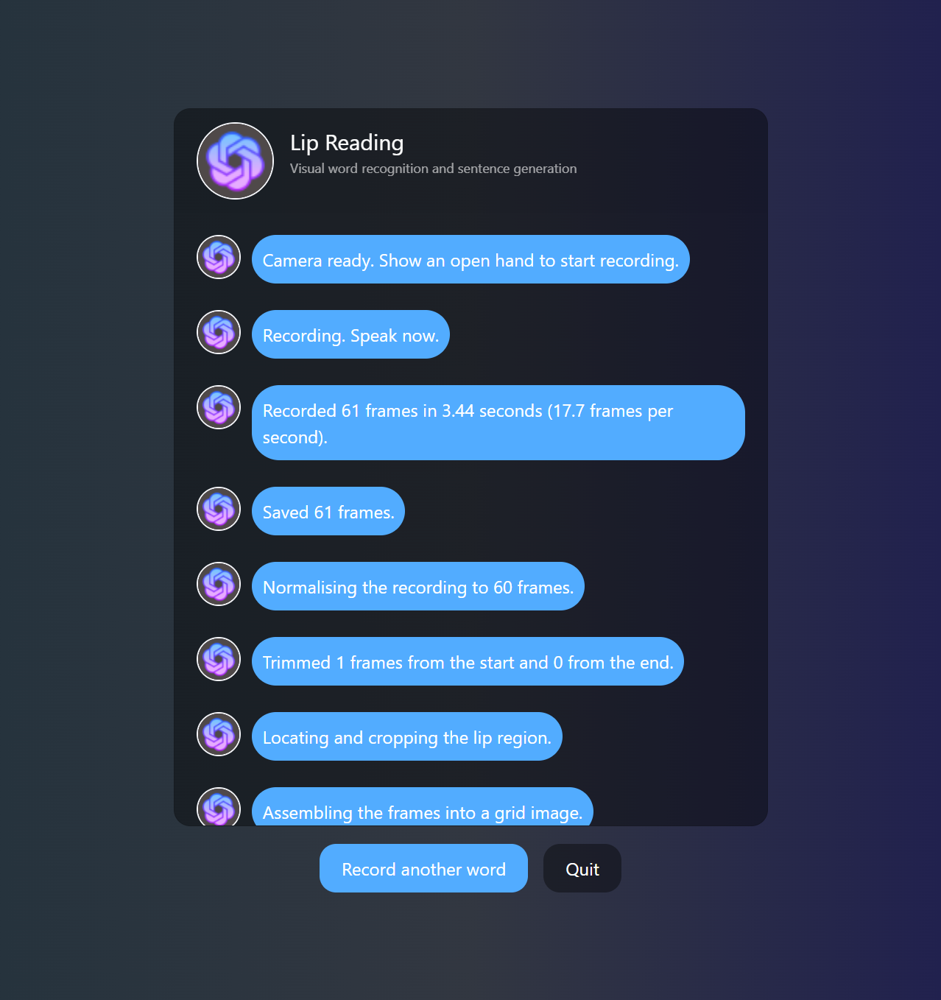

# Visual Speech Recognition

A silent-video lip reading system that recognises one of ten spoken words from
mouth movement alone, then generates a sentence containing that word. No audio
is used at any point.

This repository is a reconstruction of an MSc dissertation project originally
completed in January 2025. The system works, but the more useful part of the
project is the record of how it was rebuilt: what the original evaluation got
wrong, what a systematic architecture search found, and what it failed to find.

---

## How it works

The central problem in lip reading is that a word is a movement, not a picture.
Recognising it requires seeing how the mouth changes across time, and an
ordinary image classifier has no notion of time.

The approach taken here converts the temporal problem into a spatial one. A
recording is reduced to exactly 60 frames, the lip region is cropped from each
one, and the 60 crops are tiled into a single grid image, six columns by ten
rows. Position in that grid is frame index: the top-left cell is the first
frame, the bottom-right is the sixtieth. A conventional 2D convolutional
network then classifies the grid as one of ten words.

A fine-tuned T5-small model takes the recognised word and generates a sentence
containing it.

```
gesture starts recording  
-> 60 frames, normalised from a variable-length capture  
-> lip region cropped per frame using dlib 68-point landmarks (112 x 80)  
-> 60 crops tiled into one grid image (672 x 800)  
-> resized to 224 x 224  
-> 2D CNN classifies into one of ten words  
-> fine-tuned T5-small generates a sentence containing that word
```

<p align="center">
  
  <br>
  <em>A complete input to the model: 60 lip crops from one recording, tiled six columns across and ten rows down.
  Reading left to right, top to bottom, the sequence is the mouth movement over time.</em>
</p>

The words are bat, cup, drop, eat, fish, hot, jump, milk, pen and red, all
single-syllable. The dataset is 600 videos: one speaker, ten words, sixty
recording sessions varying in location, lighting and head angle.

The six-by-ten layout is not arbitrary. A lip crop is 112 x 80, so for a square
output the arrangement closest to square is six columns by ten rows, giving a
cell aspect ratio of 0.84. Every other factor pair of 60 distorts the mouth
substantially more.

---

## Results

|          | Full test (200 images) | Real recordings only (90) |
| -------- | ---------------------- | ------------------------- |
| Accuracy | **71.50%**             | **75.56%**                |
| Loss     | 0.8225                 | 0.6907                    |
| Macro F1 | 0.7130                 | 0.7537                    |

Model: two convolutional blocks (32, 64), Flatten, Dense(256, tanh),
Dense(128, tanh), Dense(10, softmax). 51,434,058 parameters. Adam at 1e-4,
batch size 16, 15 epochs.

### The number that matters more

The same architecture, with the same hyperparameters, reaches **98.50%** on the
dataset as it was originally split. The difference is entirely in how the split
was made.

The original split divided images by index after augmentation had been applied.
Because each recording produces sixteen augmented variants, a transformed copy
of a training recording could appear in the test set. The model was therefore
being tested partly on recordings it had already seen, and 27 points of that
98.50% was measuring recording conditions rather than mouth shapes.

The rebuilt dataset splits by recording session before augmentation, so no
augmented image derives from a session in a different split. This was verified
after assembly: zero sessions appear in more than one split.

71.50% is the lower number and the honest one. The gap between the two is the
most instructive result in the project, and the reason the reconstruction was
worth doing.

### Sentence generation

Test loss 0.5564, perplexity 8.8750, BLEU 0.0541, METEOR 0.1776,
Distinct-1 0.0120. Fluency is good, semantic alignment moderate, diversity
poor. The diversity figure is explained by the training data: 5,000 sentences
augmented from 2,000 originals covering ten words in a limited range of
situations.

---

## What the architecture search found

Roughly 117 configurations were tested across six stages, covering
architecture, training procedure, input representation, augmentation, transfer
learning from pretrained backbones, and a systematic build-up from a minimal
model. The build-up stage alone ran 689 training runs across 65 configurations.

**Nothing beat the baseline.** This is documented as a null result rather than
buried.

What did emerge are findings that hold under controlled comparison:

- **Global average pooling destroys the signal.** With identical frozen
  MobileNetV2 features, a GAP head reaches 0.310 validation and cannot fit the
  training set; a Flatten head reaches 0.618 and memorises it completely. In a
  grid image, spatial position *is* frame index, and averaging discards it.
- **tanh beats relu by 8.5 points** in the dense layers, with non-overlapping
  ranges across five seeds.
- **Two convolutional layers is the optimum.** Three and four are worse at
  every dense configuration tested.
- **Two dense layers beat one, and beat three.** Useful width is 64 to 128.
- **Memorisation here is unsolvable by regularisation.** 666 of 689 runs
  reached exactly 1.0000 training accuracy. Dropout at two rates in two
  positions, a fourteen-fold parameter reduction, and L2 across four orders of
  magnitude all failed to prevent it. Under L2 the epoch at which validation
  loss bottoms does not move at all.
- **One equivalent alternative was found.** A configuration with two
  convolutional layers and dense layers of 128 and 64, trained on a
  138-image-per-word dataset, matches the baseline on test at 25.7M parameters
  against 51.4M. Not an accuracy gain, but a legitimate efficiency result and
  the third independent demonstration that the baseline is over-parameterised.

### Where the method failed

Two configurations were promoted to test evaluation on strong validation
evidence, and both reversed. One gained 5.9 validation points through two
independent mechanisms with non-overlapping seed ranges, and lost 6 to 11
points on test.

The mechanism is worth stating plainly. With 200 validation images, one image
is 0.5 points. A 5.9-point gain is twelve images. Across sixteen
configurations, finding one that gets twelve particular images right is easy,
and it transfers to nothing. Seed variance alone is 3 to 4 points, so
non-overlapping seed ranges are not evidence of transfer.

A prediction made from receptive-field arithmetic — that greater depth would
help, because five convolutional blocks can compare adjacent frames and two
cannot — was also wrong. Two blocks won. It is recorded as a refuted
prediction rather than removed.

---

## Demonstrations

Two are included, and the difference between them is deliberate.

### Desktop application

A single window with the camera preview, progress reporting and the result.
Gesture controlled: an open hand starts recording, a closed fist ends it.

https://github.com/avikdas191/visual-speech-recognition/blob/main/docs/media/desktop_application_demo.mp4

*The full sequence, from gesture to generated sentence. The upper face and
lower body are masked; the model uses only the lip region.*

### Web application

Reproduces the original two-part arrangement, with the camera in one window and
a locally served page reporting every step. Slower and more awkward than the
desktop application, but it keeps the full processing trail visible, which is
more useful for understanding how the system works.

<p align="center">
  
  <br>
  <em>Startup: both models load, then the camera opens.</em>
</p>

<p align="center">
  
  <br>
  <em>Each stage of the pipeline reports itself. The recognised word and the generated sentence appear in green on the right.</em>
</p>

<p align="center">
  
  <br>
  <em>The blue button clears the trail and starts a new session without reopening the camera.</em>
</p>

Both applications import the same pipeline module, so both run identical
processing.

---

## Repository layout

```
src/  
config.py paths, resolved relative to the project root  
pipeline.py the processing chain, shared by both demonstrations  
data_prep/ dataset generation notebooks  
training/ model training and evaluation notebooks  
app/ the two demonstrations  
archive/ superseded code, kept as a record  
models/ trained models and the dlib landmark predictor  
docs/ method and results documentation  
runtime/ transient output, cleared on each run  
training_runs/ experiment logs, histories and summaries
```

---

## Running it

Requires Python 3.11. Dependencies are listed in `docs/environment/`.

```
cd src/app  
python lip_reading_app.py
```

The application loads both models, opens the camera, and reports progress as it
goes. The model files are not included in this repository, as explained in
[`models/README.md`](models/README.md), so the applications will not run without 
them. Everything else can be read and followed.

The system is controlled by hand gesture. Show an open hand to the camera to
start recording, speak the word silently, then close your hand into a fist to
stop. The recognised word and the generated sentence appear once processing
finishes, which takes a few seconds.

Dataset generation requires albumentations, which does not install on Windows
under Python 3.11. Those notebooks are Linux only. Everything else runs on
either platform, and both were verified to produce identical evaluation figures.

---

## What I would do differently

**The dataset is the binding constraint.** One speaker, sixty sessions, ten
words, recorded in reasonably consistent lighting. No amount of architecture
search compensates for that, which is what 117 configurations of null result
demonstrates.

**The model cannot perceive frame ordering.** A 2D convolution over a mosaic
sees texture within cells and adjacency between them, but nothing that
represents sequence. A convolutional network with a recurrent layer over the
frame sequence is the one untried direction that addresses this directly. It
was attempted and abandoned on memory grounds: 60 frames through a
time-distributed convolutional stack exhausted 8 GB of VRAM at batch size 16.
It remains the most substantive untried direction.

**The system is speaker-dependent.** It is trained on one person's mouth and
should not be expected to work for anyone else. That is a property of the
dataset, not a defect in the method.

**Validation sets this small cannot support selection across many candidates.**
The rule of selecting on validation and touching test once was set in advance
and followed, and it was still not sufficient. The size of the selection pool
relative to the validation set's resolution is the part that needs controlling.

---

## Documentation

The `docs/` directory contains the full method and results record, including
dataset construction, every experimental stage, and the deployment work. See
[`docs/README.md`](docs/README.md) for an index.

---

## Licence

MIT. See [`LICENSE`](LICENSE).
